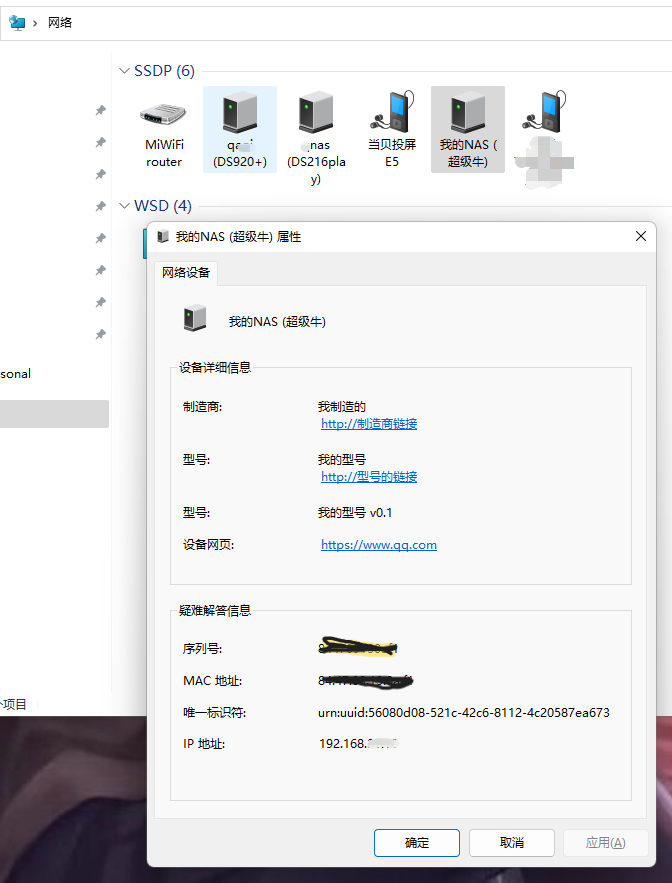

# ssdpd

让电脑端能发现设备并显示在网络列表里

## 查看可用参数

```shell
docker run --rm cnk3x/ssdpd /ssdpd -h

ssdpd - 0.4 - 让电脑端能发现设备并显示在网络列表里

命令格式:
    ssdpd [...参数选项]

参数选项:
        --alive-tick         duration  [SSDPD_SSDPD_ALIVE_TICK]        通告 Alive 时间间隔 (默认: "5m0s")
    -c, --config             string    [SSDPD_SSDPD_CONFIG]            配置文件路径, 参数优先级: 文件>启动参数>环境变量
    -n, --friendly-name      string    [SSDPD_SSDPD_FRIENDLY_NAME]     友好名称 (默认: "<hostname>")
    -l, --location           string    [SSDPD_SSDPD_LOCATION]          指定服务描述的的访问地址
        --manufacturer       string    [SSDPD_SSDPD_MANUFACTURER]      制造商
        --manufacturer-url   string    [SSDPD_SSDPD_MANUFACTURER_URL]  制造商链接
        --maxage             int       [SSDPD_SSDPD_MAXAGE]            ssdp maxage (默认: "1900")
        --model-description  string    [SSDPD_SSDPD_MODEL_DESCRIPTION] 型号描述 (默认: "SSDPD/NAS/WEB")
    -m, --model-name         string    [SSDPD_SSDPD_MODEL_NAME]        型号 (默认: "SSDPD")
        --model-number       string    [SSDPD_SSDPD_MODEL_NUMBER]      型号 (默认: "SSDPD v0")
        --model-type         string    [SSDPD_SSDPD_MODEL_TYPE]        型号类型 (默认: "NAS")
        --model-url          string    [SSDPD_SSDPD_MODEL_URL]         型号链接
    -p, --port               int       [SSDPD_SSDPD_PORT]              指定描述访问的端口， 0为随机端口 (默认: "0")
    -u, --presentation-url   string    [SSDPD_SSDPD_PRESENTATION_URL]  设备网页，双击设备默认跳转到该参数指定的地址
        --serial-number      string    [SSDPD_SSDPD_SERIAL_NUMBER]     序列号
        --server             string    [SSDPD_SSDPD_SERVER]            设备服务名称
        --udn                string    [SSDPD_SSDPD_UDN]               唯一识别符
    -v, --verbose                      [SSDPD_SSDPD_VERBOSE]           是否输出详细日志 (默认: "false")
```

## 使用

```shell

# 第一种： docker
docker run --name ssdpd --net host cnk3x/ssdpd \
    /ssdpd \
    --friendly-name '我的NAS (超级牛)' \
    --presentation-url https://www.qq.com \
    --manufacturer 我制造的 \
    --manufacturer-url http://制造商链接 \
    --model-name 我的型号 \
    --model-url http://型号的链接 \
    --model-number '我的型号 v0.1'

# 第二种： 下载使用（仅 linux amd64）
wget -O ssdpd https://github.com/cnk3x/ssdpd/releases/download/v0.3.0/ssdpd.linux.amd64
chmod +x ssdpd
./ssdpd \
    --friendly-name '我的NAS (超级牛)' \
    --presentation-url https://www.qq.com \
    --manufacturer 我制造的 \
    --manufacturer-url http://制造商链接 \
    --model-name 我的型号 \
    --model-url http://型号的链接 \
    --model-number '我的型号 v0.1'

# 第三种： 编译安装到GOPATh
go install -v github.com/cnk3x/ssdpd/cmd/ssdpd@latest
cd $(go env GOPATH)/bin
./ssdpd \
    --friendly-name '我的NAS (超级牛)' \
    --presentation-url https://www.qq.com \
    --manufacturer 我制造的 \
    --manufacturer-url http://制造商链接 \
    --model-name 我的型号 \
    --model-url http://型号的链接 \
    --model-number '我的型号 v0.1'
```

### 效果


